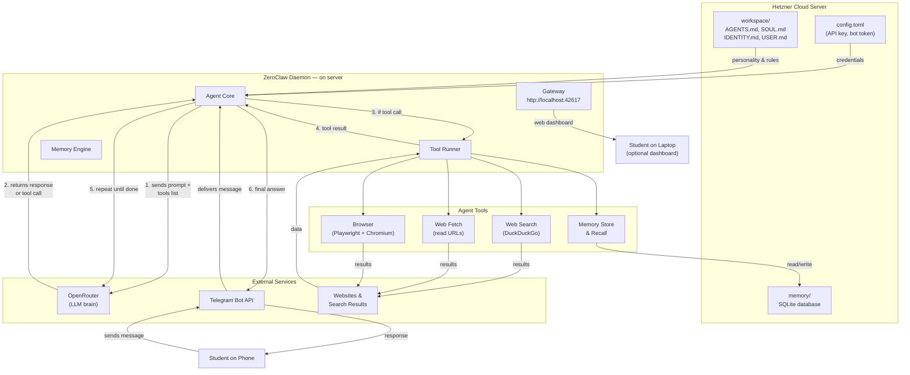
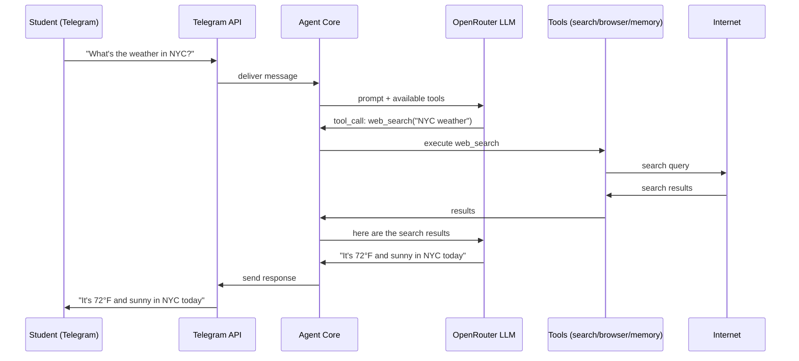
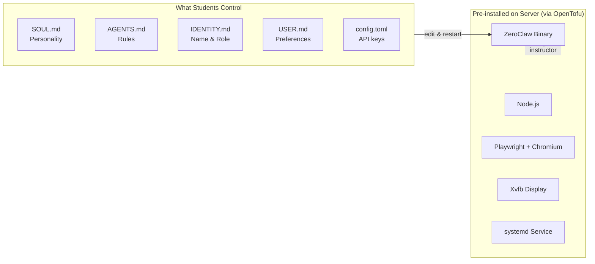

# AI Agents Course — 8-Session Plan

An 8-session hands-on course for high school students with no prior coding experience. Students go from understanding what AI is to building and presenting their own AI agent.

---

## Prerequisites — Before the Course Starts

These steps must be completed **before Session 1** so in-class time is spent learning, not troubleshooting account creation.

### What Parents Need to Do (20 minutes, one-time)

**Step 1: Create a Hetzner Cloud Account (~5 min)**
- Go to [console.hetzner.cloud](https://console.hetzner.cloud) and sign up
- A credit card is required (the server costs ~$4/month)
- Once signed in, go to **Security → API Tokens → Generate API Token** (read/write)
- Send the API token to the instructor

**Step 2: Create an OpenRouter Account (~5 min)**
- Go to [openrouter.ai](https://openrouter.ai) and sign up (Google or GitHub login)
- You get **$1 free credit** immediately (enough for weeks of casual use)
- Optionally add $5 credit at [openrouter.ai/settings/credits](https://openrouter.ai/settings/credits)
- Go to [openrouter.ai/settings/keys](https://openrouter.ai/settings/keys) → **Create Key**
- Set a **credit limit** on the key (e.g. $5) so the student can't overspend
- Send the API key to the instructor (starts with `sk-or-v1-`)

**Step 3: Install Telegram (~5 min)**
- Download Telegram on the student's phone: [telegram.org](https://telegram.org)
- Create an account if they don't have one

### What the Student Needs to Do (5 minutes)

**Step 1: Create a Telegram Bot**
- Open Telegram and search for **@BotFather**
- Send `/newbot`, pick a name and username (must end in `bot`)
- Send the bot token to the instructor

**Step 2: Get Telegram User ID**
- Search for **@userinfobot** on Telegram, send any message
- Send the user ID number to the instructor

### What the Instructor Does

Once the above is collected for each student, the instructor deploys the server:
```bash
cd infra
cp students/example.tfvars students/<student-name>.tfvars
# Fill in: hcloud_token, student_name, telegram_bot_token, telegram_user_id, openrouter_api_key
./scripts/deploy-student.sh students/<student-name>.tfvars
```

The server is live in ~4 minutes. The student can message their bot on Telegram immediately.

### Cost Summary for Parents

| Item | Monthly Cost | Notes |
|------|-------------|-------|
| Hetzner Cloud server | ~$4/month | ARM server, billed hourly |
| OpenRouter LLM access | ~$0.50–2/month | Pay-per-use, $1 free to start |
| **Total** | **~$4.50–6/month** | Cancel anytime, no contracts |

### Helpful Links

| Resource | URL |
|----------|-----|
| Hetzner Cloud | [console.hetzner.cloud](https://console.hetzner.cloud) |
| OpenRouter | [openrouter.ai](https://openrouter.ai) |
| OpenRouter Keys | [openrouter.ai/settings/keys](https://openrouter.ai/settings/keys) |
| OpenRouter Credits | [openrouter.ai/settings/credits](https://openrouter.ai/settings/credits) |
| Telegram Download | [telegram.org](https://telegram.org) |
| @BotFather (in Telegram) | Search "BotFather" inside Telegram app |
| @userinfobot (in Telegram) | Search "userinfobot" inside Telegram app |

---

## Session 1: What is AI?

**Goal:** Demystify AI. Students understand what it actually is, what it isn't, and realize they already use it every day.

**Topics:**
- What AI actually is — software that learns patterns from data
- What AI is NOT — it doesn't think, feel, or have consciousness
- Narrow AI vs General AI (every AI today is narrow)
- AI students already use: Spotify recommendations, text autocomplete, TikTok feed, Google Maps, photo filters

**Activity:**
- Open ChatGPT and ask the same question in different ways
- "Explain gravity like I'm 5" vs "Explain gravity like a PhD physicist"
- Observe how the prompt controls the output

**Key Takeaway:** AI is a tool, not magic. The person writing the instructions is in control.

---

## Session 2: How LLMs Work

**Goal:** Build intuition for how large language models work — no math, just mental models.

**Topics:**
- What is a Large Language Model — a pattern-matching machine trained on internet text
- Tokens — AI reads word pieces, not whole words ("hamburger" = 3 tokens)
- Prompts and completions — you give input, the model predicts the next word
- Temperature — the creativity dial (0 = precise, 1 = wild)
- Why longer messages cost more (more tokens = more $)

**Activity:**
- Prompt engineering challenge: write 3 different prompts for the same question
  1. Plain question
  2. With a persona ("You are a marine biologist...")
  3. With style constraints ("Explain as a rap song")
- Compare outputs, discuss what changed and why

**Key Takeaway:** The quality of AI output depends on the quality of your instructions. Prompt engineering is a real skill.

---

## Session 3: What Are AI Agents?

**Goal:** Understand the difference between a chatbot and an agent, and see a working agent in action.

**Topics:**
- Chatbot vs Agent
  - Chatbot: you ask, it answers, done
  - Agent: you ask, it thinks, uses tools, observes results, repeats until done
- The Agent Loop: Think → Act → Observe → Repeat
- Agent tools: web search, web browser, memory
- How the agent decides which tool to use

**Demo:**
- Instructor shows their own agent on Telegram
- Send it a live question that requires web search
- Show the tool notifications appearing in real-time
- Ask it to remember something, then recall it later

**Key Takeaway:** An agent is an AI with hands. It doesn't just talk — it can search, browse, and remember.

---

## Session 4: Setup Day

**Goal:** Every student has a working AI agent on their phone by end of class.

**Prerequisites (completed before this session — see Prerequisites section above):**
- Parent created Hetzner Cloud account and shared API token with instructor
- Parent created OpenRouter account and shared API key with instructor
- Student created Telegram bot and shared bot token + user ID with instructor
- Instructor deployed each student's server via OpenTofu

**In-Class Walkthrough:**

1. **First Message** (5 min)
   - Each student opens Telegram, finds their bot by username
   - Send "Hello!" — celebrate when it responds!

2. **Set Up SSH Access** (10 min)
   - Instructor hands each student their SSH key file and server IP
   - Students copy the key to `~/.ssh/` and add the SSH config snippet
   - Test: `ssh zc-YOURNAME` should connect to the server

3. **Set Up VS Code Remote SSH** (10 min)
   - Install VS Code + "Remote - SSH" extension
   - Cmd+Shift+P → "Remote-SSH: Connect to Host" → select `zc-YOURNAME`
   - Open folder `~/.zeroclaw/workspace/`
   - Students now see all workspace files in their editor

4. **Explore the Dashboard** (5 min)
   - Open `http://YOUR_SERVER_IP:42617` in a browser
   - See conversations and agent status

5. **Try a Quick Edit in VS Code** (10 min)
   - Open `IDENTITY.md` in VS Code and change the agent's name
   - Open the VS Code terminal, run: `sudo systemctl restart zeroclaw`
   - Send a message on Telegram — see the new name in action

**Troubleshooting Buffer:** 15 min for students who hit issues

**Key Takeaway:** You now have your own AI agent on a cloud server, editable from VS Code, and reachable from your phone — anywhere, anytime.

---

## Session 5: How Your Agent Works

**Goal:** Understand the files that control agent behavior and experience changing them.

**Topics:**
- Workspace files = Agent DNA
  - `AGENTS.md` — rules the agent must follow
  - `SOUL.md` — personality and communication style
  - `TOOLS.md` — guidance on when to use which tools
  - `IDENTITY.md` — name and role
  - `USER.md` — info about you
- The config: provider, model, temperature, enabled tools
- The feedback loop: edit file → restart → test → repeat

**Activity 1: Change the Personality**
- Open VS Code, connect to `zc-YOURNAME` via Remote SSH
- Open `SOUL.md` in the workspace folder
- Change it to: "You are a pirate captain. Respond in pirate speak."
- Open VS Code terminal, run: `sudo systemctl restart zeroclaw`
- Send a message — observe the pirate responses
- Try other personalities: sports coach, cartoon character, Shakespearean actor

**Activity 2: Add a Rule**
- Open `AGENTS.md` in VS Code
- Add: "Always end your response with a fun fact"
- Restart and test — every response now ends with a fun fact

**Key Takeaway:** You control your agent's behavior through text files. No coding required — just clear instructions in English.

---

## Session 6: Tools and Capabilities

**Goal:** Understand what each tool does and when the agent uses it.

**Topics:**
- **Web Search** — searches the internet, reads results, summarizes
  - Good for: current events, facts, weather, sports scores
  - Without it, the agent only knows its training data (months old)
- **Web Browser** — opens real websites, clicks, reads content
  - Good for: interactive sites, JavaScript-heavy pages, form filling
  - Slowest tool but most powerful
- **Memory** — stores and recalls facts across conversations
  - Good for: preferences, repeated questions, personalization
  - Makes the agent feel like it "knows" you

**Activity: Tool Testing Challenge**
- Send these messages to your bot and observe which tools it uses:
  1. "What's the latest news about AI today?" (web search)
  2. "Remember that I like pizza and basketball" (memory store)
  3. "What do you remember about me?" (memory recall)
  4. "Go to wikipedia.org and tell me today's featured article" (browser)
- Watch the tool notification messages in Telegram
- Discuss: which tool was used for each? Why?

**Discussion:**
- What happens if you ask a factual question but web search is disabled?
- Why does the agent sometimes pick the wrong tool?
- How could you add rules to guide tool selection?

**Key Takeaway:** Tools give your agent real-world capabilities. The right tool for the right job makes your agent useful.

---

## Session 7: Build Your Agent

**Goal:** Each student designs and builds an agent that solves a problem they care about.

**Part 1: Pick Your Problem (15 min)**

Brainstorm ideas. Examples:
- Homework helper — explains concepts, finds examples
- Sports tracker — checks scores and news for your favorite teams
- Weather briefer — daily weather report for your area
- News reader — summarizes news on topics you pick
- Study buddy — quizzes you on material you're learning
- Recipe finder — suggests meals based on ingredients you have
- Music discoverer — finds new music based on what you like
- College prep — finds scholarship deadlines and application tips

Students write down: What problem? Who is it for? What should it do?

**Part 2: Design Your Agent (15 min)**

Fill out the design worksheet:
1. **Name** — what's your agent called?
2. **Personality** — how does it talk? (friendly, formal, funny, coach-like)
3. **3-5 Rules** — what must it always do? (cite sources, be brief, use emojis)
4. **Tools needed** — web search? browser? memory?
5. **Identity** — what's its role in one sentence?

**Part 3: Build It (20 min)**

- Open VS Code, connect to `zc-YOURNAME` via Remote SSH
- Edit `IDENTITY.md` — name and role
- Edit `SOUL.md` — personality description
- Edit `AGENTS.md` — rules
- Edit `USER.md` — info about yourself
- VS Code terminal: `sudo systemctl restart zeroclaw`
- Test on Telegram

**Part 4: Iterate (10 min)**

- Is it too wordy? Add a rule: "Keep responses under 100 words"
- Not searching? Add: "Always search the web for factual questions"
- Too formal? Rewrite SOUL.md to be more casual
- Test, adjust, repeat

**Homework:** Continue refining your agent before Demo Day

**Key Takeaway:** Building AI products is about writing clear instructions and iterating. This is how real AI engineers work.

---

## Session 8: Demo Day

**Goal:** Students present their agents, celebrate what they built, and understand where to go next.

**Presentation Format (5 min per student):**
1. What problem does your agent solve?
2. Live demo — send it a message on Telegram, show the response on screen
3. What personality and rules did you give it?
4. What surprised you? What would you change with more time?

**Class Discussion After Demos:**
- Which agents were most creative?
- Which rules worked best?
- What was the hardest part — the AI or the instructions?
- How is this similar to how real companies build AI products?

**What You Learned (Recap):**
- What AI is and how LLMs work
- The difference between chatbots and agents
- How to design agent behavior with natural language instructions
- How tools give AI real-world capabilities
- How to build, test, and iterate on an AI agent

**Where to Go From Here:**
- Add more tools — connect to APIs, calendars, databases
- Build multi-agent systems — agents that delegate to specialists
- Learn Python — write custom tools for your agent
- Try other AI models — Claude, Gemini, open-source models
- Explore careers — AI engineering, prompt engineering, product management
- Join communities — GitHub, Discord, local AI meetups

**Key Takeaway:** You built something most adults haven't. You understand AI at a level that matters. Keep building.

---

## How the End Product Works



### How a Single Message Flows



### What Students Customize vs What's Fixed



---

## Materials Checklist

| Item | Who Provides | When |
|------|-------------|------|
| Hetzner Cloud account + API token | Parent | Before Session 1 |
| OpenRouter account + API key | Parent | Before Session 1 |
| Telegram on phone | Student | Before Session 1 |
| Telegram bot token + user ID | Student | Before Session 1 |
| Server deployment via OpenTofu | Instructor | Before Session 4 |
| Slide deck (`AI_Agents_Course.pptx`) | Instructor | Session 1 |
| Parent info slide (`Parent_Setup_Guide.pptx`) | Instructor | Before Session 1 |
| Projector / screen for demos | Classroom | All sessions |

## Session Timing

Each session is approximately 60 minutes:
- 15 min instruction / slides
- 30 min hands-on activity
- 10 min discussion / Q&A
- 5 min wrap-up and preview of next session
